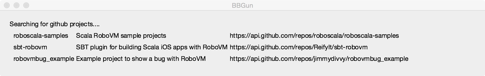

Stripped down app to demonstrate an issue with 
Scala [Dispatch](http://dispatch.databinder.net) and [RoboVM](http://robovm.com).

If you invoke `./gradlew desktop:run` you should see a simple window that 
displays some basic data fetched from the github api repo search.



If you then run `./gradlew ios:launchIPadSimulator` you'll see the simulator 
start up, launch the app, then hang. The following traceback appears in the 
console:

```
java.lang.RuntimeException: Exception in Application start method

	at com.sun.javafx.application.LauncherImpl.launchApplication1(LauncherImpl.java)
	at com.sun.javafx.application.LauncherImpl.lambda$launchApplication$155(LauncherImpl.java)
	at com.sun.javafx.application.LauncherImpl$$Lambda$74.run(Unknown Source)
	at java.lang.Thread.run(Thread.java)
Caused by: dispatch.InternationalDomainConversionException$

	at dispatch.InternationalDomainConversionException$.<clinit>(IDN.scala)
	at dispatch.IDNDomainHelpers$.safeConvert(IDN.scala:13)
	at dispatch.HostVerbs$class.apply(requests.scala:48)
	at dispatch.host$.apply(requests.scala:54)
	at bbgun.BBGunApp.<init>(BBGunApp.scala:19)
	at bbgun.MobileApp.start(MobileApp.java:19)
	at com.sun.javafx.application.LauncherImpl.lambda$launchApplication1$162(LauncherImpl.java)
	at com.sun.javafx.application.LauncherImpl$$Lambda$81.run(Unknown Source)
	at com.sun.javafx.application.PlatformImpl.lambda$runAndWait$175(PlatformImpl.java)
	at 
com.sun.javafx.application.PlatformImpl$$Lambda$93.run(Unknown Source)
	at com.sun.javafx.application.PlatformImpl.lambda$null$173(PlatformImpl.java)
	at com.sun.javafx.application.PlatformImpl$$Lambda$105.run(Unknown Source)
	at java.security.AccessController.doPrivileged(AccessController.java)
	at com.sun.javafx.application.PlatformImpl.lambda$runLater$174(PlatformImpl.java)
	at com.sun.javafx.application.PlatformImpl$$Lambda$92.run(Unknown Source)
	at org.robovm.apple.uikit.UIApplication.main(Native Method)
	at org.robovm.apple.uikit.UIApplication.main(UIApplication.java)
	at org.javafxports.jfxmobile.ios.BasicLauncher.main(BasicLauncher.java:115)
```

## Update

So if I reduce this further and have the main class just call 
`java.net.IDN.toASCII("api.github.com")` then we see the same hanging/crashing 
behavior and a new (more interesting) traceback:

```
java.lang.RuntimeException: Exception in Application start method

	at com.sun.javafx.application.LauncherImpl.launchApplication1(LauncherImpl.java)
	at com.sun.javafx.application.LauncherImpl.lambda$launchApplication$155(LauncherImpl.java)
	at com.sun.javafx.application.LauncherImpl$$Lambda$74.run(Unknown Source)
	at java.lang.Thread.run(Thread.java)
Caused by: java.lang.IllegalArgumentException: U_FILE_ACCESS_ERROR

	at libcore.icu.NativeIDN.convertImpl(Native Method)
	at libcore.icu.NativeIDN.convert(NativeIDN.java)
	at libcore.icu.NativeIDN.toASCII(NativeIDN.java)
	at java.net.IDN.toASCII(IDN.java)
	at java.net.IDN.toASCII(IDN.java)
	at bbgun.MobileApp.start(MobileApp.java:20)
	at com.sun.javafx.application.LauncherImpl.lambda$launchApplication1$162(LauncherImpl.java)
	at com.sun.javafx.application.LauncherImpl$$Lambda$81.run(Unknown Source)

	at com.sun.javafx.application.PlatformImpl.lambda$runAndWait$175(PlatformImpl.java)
	at com.sun.javafx.application.PlatformImpl$$Lambda$93.run(Unknown Source)
	at com.sun.javafx.application.PlatformImpl.lambda$null$173(PlatformImpl.java)
	at com.sun.javafx.application.PlatformImpl$$Lambda$105.run(Unknown Source)
	at java.security.AccessController.doPrivileged(AccessController.java)
	at com.sun.javafx.application.PlatformImpl.lambda$runLater$174(PlatformImpl.java)
	at com.sun.javafx.application.PlatformImpl$$Lambda$92.run(Unknown Source)
	at org.robovm.apple.uikit.UIApplication.main(Native Method)
	at org.robovm.apple.uikit.UIApplication.main(UIApplication.java)
	at org.javafxports.jfxmobile.ios.BasicLauncher.main(BasicLauncher.java:115)
```

Not sure what to make of the `U_FILE_ACCESS_ERROR`, so hopefully someone else 
can tell me what the story is.